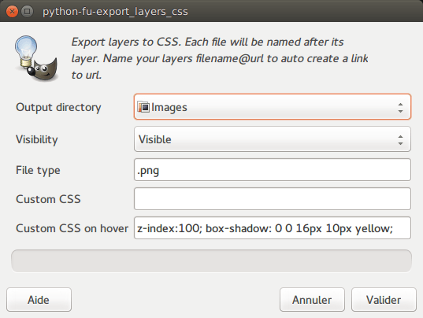

# Layerstodivs

## Description

Gimp plugin to create html divs from gimp layers

Based on Lars Pontoppidan's Export Layers (https://github.com/Larpon/gimp-plug-ins)

This plugin for Gimp is used to export each folder to its own image file, and generate a HTML file 
containing Divs based on the position of the layers. It recreates the image with div blocks.

Optionaly, some custom CSS can be applied to the divs, and to the *:hover* state of the divs.

If a layer is named anything*@an_url*, i.e. includes an "@" followed by some url, a link to this url will be auto generated.

## Install

To install, see [the WikiBook](https://en.wikibooks.org/wiki/GIMP/Installing_Plugins#Copying_the_plugin_to_the_GIMP_plugin_directory). 

## License

 This program is free software: you can redistribute it and/or modify
 it under the terms of the GNU General Public License as published by
 the Free Software Foundation, either version 3 of the License, or
 (at your option) any later version.

 This program is distributed in the hope that it will be useful,
 but WITHOUT ANY WARRANTY; without even the implied warranty of
 MERCHANTABILITY or FITNESS FOR A PARTICULAR PURPOSE.  See the
 GNU General Public License for more details.

 You should have received a copy of the GNU General Public License
 along with this program.  If not, see <http://www.gnu.org/licenses/>.
