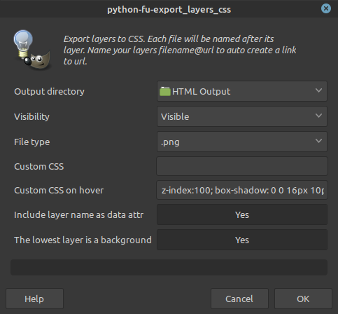

# Layerstodivs

## Description

Gimp plugin to create html divs from gimp layers.

Based on Lars Pontoppidan's Export Layers (https://github.com/Larpon/gimp-plug-ins).

This plugin for Gimp is used to export each layer to its own image file, and generate an HTML file 
containing Divs based on the position of the layers. It recreates the image with div blocks.

An example of the result can be seen in [Ardour's manual](http://manual.ardour.org/ardours-interface/about/).

## Features
 - Insert custom CSS styles inline in the divs
 - Customize :hover state
 - Set lowest layer as a background
 - Include the layer name as data-layer-name

## Usage
If you would like your layer's div to act as a hyperlink, include the target
URL after an @ symbol. For example, a GIMP layer named:

`Big Box@https://asdf.com/`

Would encapsulate the div for that layer in an `<a>` tag

| Screenshots|  |
| ------------- | ------------- |
|   |   |
| Puts itself into the *file* dialog  | The dialog for export options |
## Installation

To install, see [the WikiBook](https://en.wikibooks.org/wiki/GIMP/Installing_Plugins#Copying_the_plugin_to_the_GIMP_plugin_directory). 

Linux:
Put `layerstodiv.py` in `~/.gimp-2.8/plug-ins/` and add execution priviledges to the file.

## License

 This program is free software: you can redistribute it and/or modify
 it under the terms of the GNU General Public License as published by
 the Free Software Foundation, either version 3 of the License, or
 (at your option) any later version.

 This program is distributed in the hope that it will be useful,
 but WITHOUT ANY WARRANTY; without even the implied warranty of
 MERCHANTABILITY or FITNESS FOR A PARTICULAR PURPOSE.  See the
 GNU General Public License for more details.

 You should have received a copy of the GNU General Public License
 along with this program.  If not, see <http://www.gnu.org/licenses/>.
